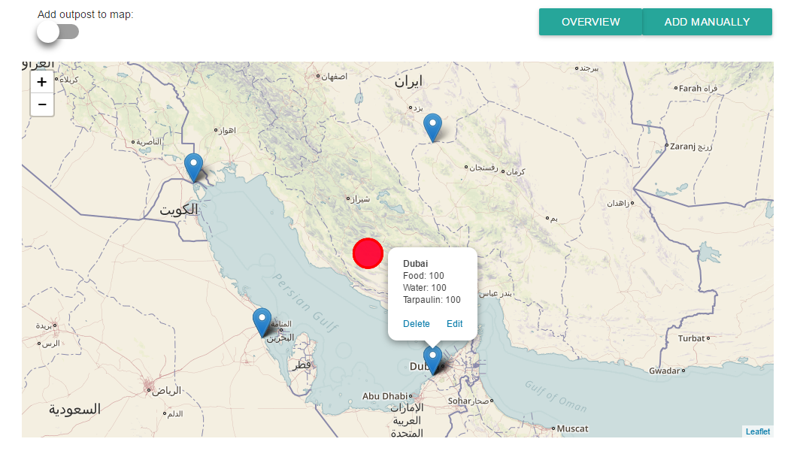

##Demo app for a developer recruitment hackathon

I learned Node, Express, and Handlebars over 2-3 days whilst making this demo app, then went on to run a Node.js bootcamp (a 90 minute webinar) and mentor students through the recruitment process.

The app attempts to address the issue of managing distribution of supplies after an earthquake, and showcases some of the basic capabilities of Node.js and the Express framework.

I pull live data from the US Geological Survey API and use Leaflet.js for mapping; I also used [SweetAlert](http://t4t5.github.io/sweetalert/) and [DataTables](https://datatables.net/) to make it look pretty.

##### Displaying outposts and earthquake data pulled from the USGS API

##### Adding an outpost to the map

##### An outpost showing the supplies available

###### The overview page showing the remaining supplies at each location

